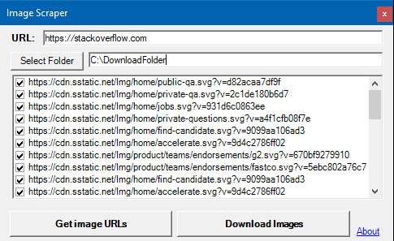

# Image Scraper
 
A simple program that allows you to download all images from a website. Entirely made in C++ with Visual Studio 2019. 
Released under MIT license. Made by PrismSight. 
**Note: This only downloads the images that are in the IMG tags**

### How to use
1. Download the .exe
2. Open the .exe.
3. Type in the URL of the page you want to download all the images from.
4. Select the folder you wish to put all the downloaded images in.
5. Press the  "Get Image URLs" button.
6. Select the images you would like to download.
7. Press the "Download Images" button.

### How to build
1. use CMake to build a Visual Studio Project. (Ignore the warning)
2. Open the solution in Visual Studio.
3. Build the ImageScraper project.

### To do
* ~~Implement CMake~~
* Make it so you have the option of downloading the images that are not in IMG tags as well?
* Make loading bar?
* Make it for Mac/Linux as well?

### Credits
Icon from: [OpenClipart-Vectors](https://pixabay.com/vectors/arrows-down-download-red-glossy-147745/)