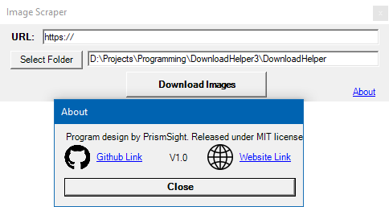

# Image Scraper
 
A simple program that allows you to download all images from a website. Entirely made in C++ with Visual Studio 2019. 
Released under MIT license. Made by PrismSight. 
**Note: This only downloads the images that are in the IMG tags**

### How to use
1. [Download the .exe here.](x64/Release/DownloadHelper.exe)
2. Open the .exe.
3. Type in the URL of the page you want to download all the images from.
4. Select the folder you wish to put all the downloaded images in.
5. Press the "Download Images" button

### Build
Use Visual Studio 2019 to build the program from source code.

### To do
* Make it so you have the option of downloading the images that are not in IMG tags as well?
* Make it for mac/linux as well?
* Make loading bar?
